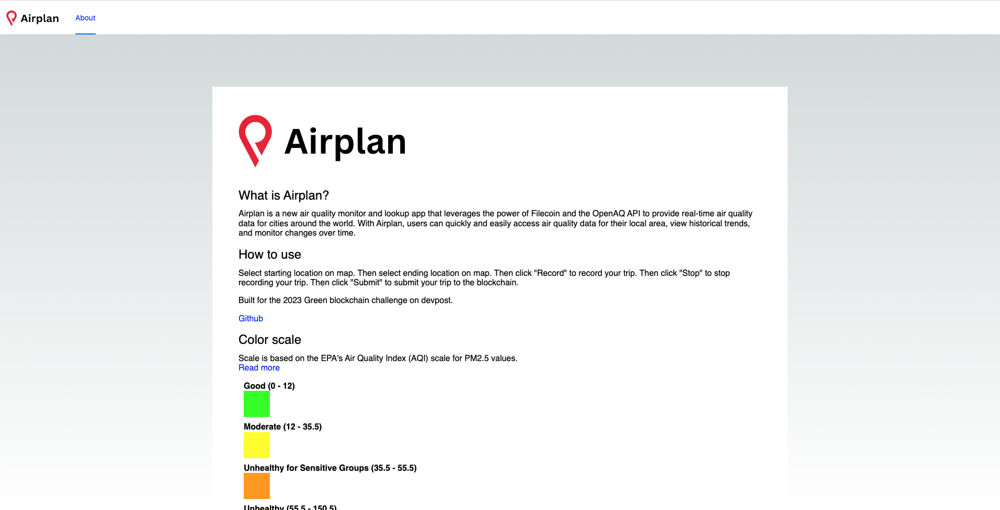

    

Airplan
---

Introducing Airplan - a new air quality monitor and lookup app that leverages the power of Filecoin and the OpenAQ API to provide real-time air quality data for cities around the world. With Airplan, users can quickly and easily access air quality data for their local area, view historical trends, and monitor changes over time.

Live url: https://airplan.surge.sh/

Demo Video: https://youtu.be/FAoDxYhY-bE

Built for the Protocol Labs (Filecoin Green) sustainable hackathon 2023.

### Background

Built on the decentralized Filecoin network, Airplan stores and distributes air quality data in a secure and efficient manner, ensuring that data is always available and tamper-proof. This makes it an ideal platform for public health officials, researchers, and other stakeholders who require reliable air quality data for decision-making and analysis.

Whenever an API call is made, live air quality data is pulled and rendered around the location the user selects.

The user can click 'start recording' when 'end recording' is clicked the user's route and metadata gets saved to filecoin as a record of the user's air quality trip.

By combining the power of Filecoin with the OpenAQ API, Airplan is poised to become a leader in the air quality monitoring space, providing critical data and insights to support public health and environmental initiatives around the world. Over time and use, Airplan creates a catalogue/historic archive of user routes as json objects backed up permanently to ipfs.

### How it works

Using the OpenAQ API (free for public use), Airplan pulls air quality data from a variety of sources, including government sensors, satellites, and crowdsourced data, to provide the most comprehensive and up-to-date data available. Users can search for air quality data by city or geographic location, and can view detailed information on a variety of pollutants, including particulate matter (PM2.5 and PM10), ozone, nitrogen dioxide, and sulfur dioxide.

### How to run

1. Define the following env variables in a `.env` file

<pre>
    NEXT_PUBLIC_WEB3_STORAGE_KEY= # your web3.storage api key. Used for hosting env data to web3/filecoin storage.
</pre>

2. `yarn; yarn dev`

The app should now be running on port 3000.

### Example recorded Airplan
https://bafybeidlajl7oippalzcosili3uizggjanegqaxpjwkawsy7vv6puh634e.ipfs.w3s.link/

### Screenshots

#### Main map view

#### Quick navigate

#### Completed journey

#### Uploaded result (shareable / permanent archive)

#### Uploaded result (json)

#### About page with air quality scale

### Potential future work

1. Customizable Air Quality Alerts: Allow users to set up customizable air quality alerts to be notified when the air quality index (AQI) in their area reaches a certain level, or when specific pollutants exceed a certain threshold. This would require implementing a notification system that leverages the OpenAQ API to pull in real-time air quality data.

2. Air Quality Data Visualization: Provide interactive visualizations that allow users to explore air quality data over time, across different pollutants, and across different geographic regions. This could be achieved by leveraging existing data visualization libraries and APIs to create charts, maps, and other interactive visualizations.

3. Air Quality News and Education: Add a section to the app that provides news articles, educational resources, and tips for improving air quality. This would require curating content from trusted sources and creating a simple interface for displaying the content within the app.

4. Simple Air Quality Reporting: Allow users to quickly and easily report air quality observations in their local area, using a simple form that captures basic information about the observation, such as the location, date, and time. This would require implementing a form within the app that can capture user input and send it to a backend database.

5. Aggregate journies: Use the collection of stored journies from the Airplan app to create useful visualizations, or allow the users to correct or add comments around air quality reports in real time from the web.

